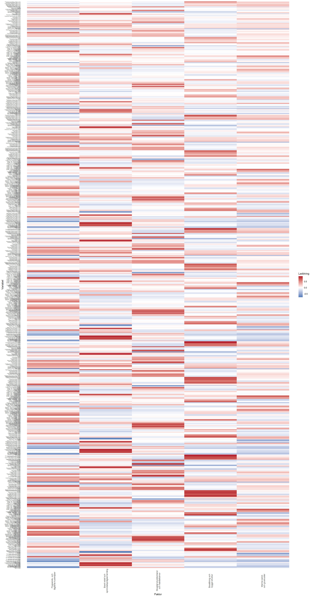
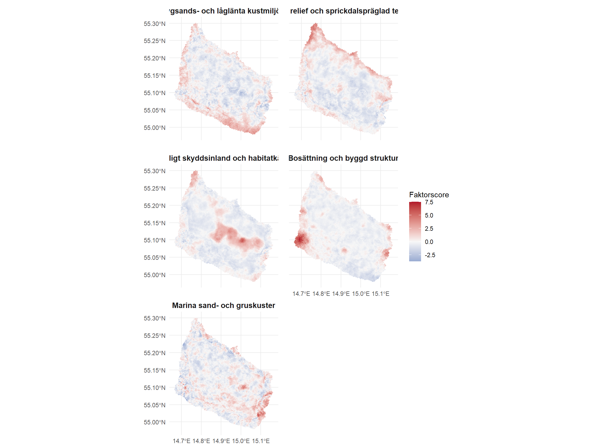
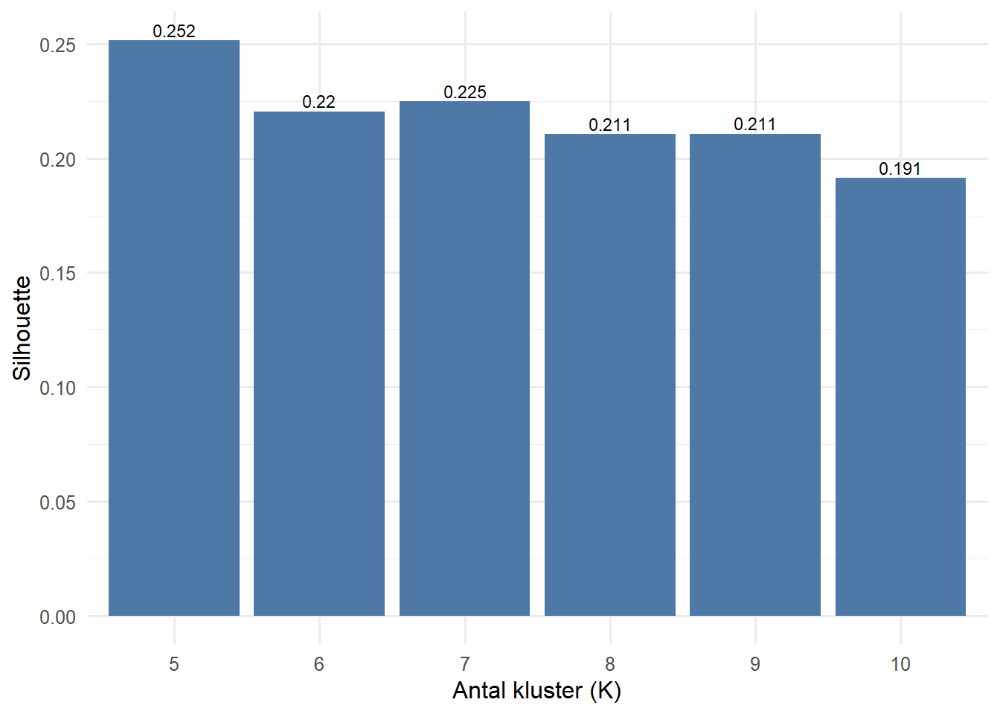
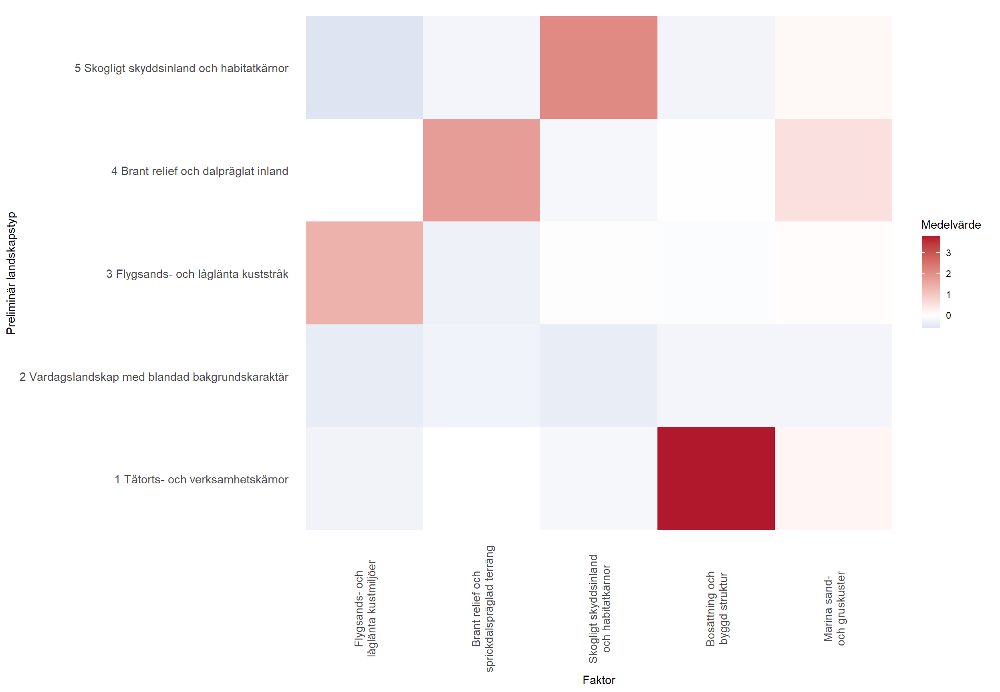

> This report presents the current landscape analysis for Bornholm. It focuses on how the island's landscape character can be described through a multiscalar, hexagon-based analytical framework that combines nature, settlement, accessibility, protection, restrictions, and geology.

## Map Overview

The combined map is placed first in the report and is intended as the main surface for interpretation. In the web version, the reader can switch between clusters and factors in the same HTML map, read clear legends, and open popups showing type, interpretation, factor profile, and the layers in each hexagon that contribute most to the analysis.

**Interactive map placeholder:** The combined cluster and factor map is available in the original web report: https://gislab-se.github.io/landskapsanalys/published_report/landskapsanalys_v4_combined_map.html

[Open the combined map in the web report](https://gislab-se.github.io/landskapsanalys/published_report/landskapsanalys_v4_combined_map.html)

## 1. Purpose and Main Question

This report describes the current landscape analysis for Bornholm. The aim is to provide a clear and traceable basis for describing how the island's landscape is structured, where different landscape contexts dominate, and which patterns recur across several scales.

The main question is:

**What landscape character does Bornholm have when the island is described through a multiscalar, hexagon-based analytical framework that combines nature, settlement, accessibility, protection, restrictions, and geology?**

The report has three concrete tasks:

- to document which data are actually included in the model
- to explain, step by step, how raw data become factors and preliminary landscape types
- to provide an interpretation that is understandable even for readers who do not work with factor analysis and clustering on a daily basis

In the longer term, the same analytical chain may become one of several inputs to an acceptance layer for wind power and solar energy. This report is, however, a **landscape-character report**, not a completed planning decision. It says something important about structure, patterns, and landscape types, but it does not make the full trade-off between landscape values, law, technology, and social acceptance.

The central value at this stage is that the model covers large parts of Bornholm's relevant landscape content and also uses a terrain track derived from the original contour lines. The remaining work is therefore mainly about validation, naming, and fine-tuning how agricultural plateaus and fracture-valley-like terrain should be expressed.

## 2. Study Area, Scale, and Delimitation

The analysis covers Bornholm using the same R9 hex grid as earlier runs, following H3's resolution system ([H3: Tables of Cell Statistics Across Resolutions](https://h3geo.org/docs/core-library/restable/)). The fixed analytical unit is therefore a regular hexagon, while landscape character emerges by describing each hexagon both locally and through its surroundings.

|Aspect                         |Value    |
|:-------------------------------|:--------|
|Study area                     |Bornholm |
|Base resolution                |R9 hex   |
|Number of analysis hexagons    |7,286    |
|Excluded sea hexagons without signal |605 |
|Number of input layers         |68       |
|Number of context variables    |680      |
|Selected number of clusters    |5        |
|Hexagons without signal in total weight |0 (0.0%) |

The scale choice has three consequences:

- the analysis is good at describing regional and medium-scale patterns
- it is weaker for very small local qualities that exist only across a few hectares
- it should not be read as if each individual hexagon were already a landscape area in itself

## 3. Data Basis

The analysis is based on 68 layer signals. The data basis is therefore broad enough to capture Bornholm as both a physical-geographic and cultural-geographic landscape: forest, agriculture, topography, coast, water, cultural environment, settlement, protection, restrictions, and geology are now included in the same analytical framework.

In concrete terms, this means that each raw layer is first translated into a comparable hex signal: point layers as counts or summed attribute values per hexagon, line layers as line length within the hexagon, polygon layers as area or area share, and terrain layers as summary statistics per hexagon.

A particularly important point in this report is that topography is not described only through earlier hex-aggregated elevation metrics. The analysis also uses a **contour-derived pseudo-DEM** from the original contour lines, from which mean elevation, slope, and a local valley-depth signal are aggregated back to the hexagons.

Another particularly important point in this report is that two earlier provisional geology layers have been replaced by **21 interpretable subcategories** from Jordart and Prekvart. This means that geology is no longer present only as an almost complete background, but as an actual landscape signal that can be read and compared with other themes.

Broadly speaking, the data basis consists of the following groups:

- settlement and accessibility: population, roads, ferry routes, and several settlement layers
- blue-green structures: lakes, wetlands, heath, forest, ecological connectivity, nature types, and watercourses
- coastal context: coastline, coastal zone, sand dunes, and shore protection
- culture and land use: cultural-environment values, valuable cultural environments, and agricultural land
- topography and geology: relief, highest elevation, contour-derived mean elevation, contour-derived slope, contour-derived valley depth, Quaternary surface geology, and pre-Quaternary bedrock
- protection and restrictions: Natura areas, protected areas, reserves, military areas, and aviation-restriction layers

The table below is the most important reference for exact content and should be read as the model's official layer list. The focus is on what the layer is, what type of hex signal it becomes, and where the data come from.

|Layer                                        |Geometry           |Theme             |Data source                                            |Hex signal                                        |
|:--------------------------------------------|:------------------|:----------------|:----------------------------------------------------|:------------------------------------------------|
|Permanent population                         |Point count        |Settlement       |BRK (Bornholms Regionskommune)                       |Count per hexagon                                |
|Road length (medium)                         |Line length        |Access           |GeoDanmark via Klimadatastyrelsen                    |Line length within the hexagon                        |
|Road length (large)                          |Line length        |Access           |GeoDanmark via Klimadatastyrelsen                    |Line length within the hexagon                        |
|Ecological connectivity                      |Polygon area share |Blue-green       |Source data in the Bornholm geocontext stack                 |Share of hexagon area                          |
|Cultural and historical conservation values  |Polygon area share |Culture          |Source data in the Bornholm geocontext stack                 |Share of hexagon area                          |
|Fredskov                                     |Polygon area share |Vegetation       |Geodatastyrelsen MAT2 (GDS)                          |Share of hexagon area                          |
|Agricultural land (Markblokke)               |Polygon area share |Land use         |Markblokke 2026 (local agricultural data; not in the SL01 PDF) |Share of hexagon area                          |
|Relief                                       |Continuous metric  |Topography       |GeoDanmark via Klimadatastyrelsen                    |Summary terrain metric per hexagon             |
|Protected watercourses                       |Line length        |Blue-green       |Danmarks Miljoeportal / Miljoestyrelsen (MP/MST)       |Line length within the hexagon                        |
|Lake                                         |Polygon area share |Blue-green       |GeoDanmark via Klimadatastyrelsen (GD-V/KDS)         |Share of hexagon area                          |
|Wetland                                      |Polygon area share |Blue-green       |GeoDanmark via Klimadatastyrelsen (GD-V/KDS)         |Share of hexagon area                          |
|Moor and heath                                |Polygon area share |Blue-green       |GeoDanmark via Klimadatastyrelsen (GD-V/KDS)         |Share of hexagon area                          |
|Forest                                       |Polygon area share |Vegetation       |GeoDanmark via Klimadatastyrelsen (GD-V/KDS)         |Share of hexagon area                          |
|Coastal zone (3 km)                          |Polygon area share |Coast            |Source data in the Bornholm geocontext stack                 |Share of hexagon area                          |
|Coastline                                    |Line length        |Coast            |GeoDanmark via Klimadatastyrelsen (GD-V/KDS)         |Line length within the hexagon                        |
|Valuable cultural environment                |Polygon area share |Culture          |Slots- og Kulturstyrelsen (SLKS)                     |Share of hexagon area                          |
|Highest contour value                        |Continuous metric  |Topography       |GeoDanmark via Klimadatastyrelsen                    |Summary terrain metric per hexagon             |
|River length                                 |Line length        |Blue-green       |GeoDanmark via Klimadatastyrelsen (GD-V/KDS)         |Line length within the hexagon                        |
|Sand dune                                    |Polygon area share |Coast            |GeoDanmark via Klimadatastyrelsen (GD-V/KDS)         |Share of hexagon area                          |
|Protected nature types                       |Polygon area share |Blue-green       |Danmarks Miljoeportal / Miljoestyrelsen (MP/MST)       |Share of hexagon area                          |
|Mapped nature types                          |Polygon area share |Blue-green       |Danmarks Miljoeportal / Miljoestyrelsen (MP/MST)       |Share of hexagon area                          |
|Industry and business land                   |Polygon area share |Settlement       |GeoDanmark via Klimadatastyrelsen                    |Share of hexagon area                          |
|Built centre                                 |Polygon area share |Settlement       |GeoDanmark via Klimadatastyrelsen (GD-V/KDS)         |Share of hexagon area                          |
|Buildings high                               |Polygon area share |Settlement       |GeoDanmark via Klimadatastyrelsen (GD-V/KDS)         |Share of hexagon area                          |
|Buildings low                                |Polygon area share |Settlement       |GeoDanmark via Klimadatastyrelsen (GD-V/KDS)         |Share of hexagon area                          |
|Shore protection                            |Polygon area share |Coast            |Source data in the Bornholm geocontext stack                 |Share of hexagon area                          |
|Jordart - ML - Moræneler                     |Polygon area share |Geology          |Source data in the Bornholm geocontext stack                 |Share of hexagon area                          |
|Jordart - MS - Morænsand                     |Polygon area share |Geology          |Source data in the Bornholm geocontext stack                 |Share of hexagon area                          |
|Jordart - FP - Ferskvandsgytje               |Polygon area share |Geology          |Source data in the Bornholm geocontext stack                 |Share of hexagon area                          |
|Jordart - ES - Flyvesand                     |Polygon area share |Geology          |Source data in the Bornholm geocontext stack                 |Share of hexagon area                          |
|Jordart - DS - Smeltevandssand               |Polygon area share |Geology          |Source data in the Bornholm geocontext stack                 |Share of hexagon area                          |
|Jordart - PKV - Prækvartært lag              |Polygon area share |Geology          |Source data in the Bornholm geocontext stack                 |Share of hexagon area                          |
|Jordart - Marine sand and gravel - other      |Polygon area share |Geology          |Source data in the Bornholm geocontext stack                 |Share of hexagon area                          |
|Jordart - Freshwater and organic deposits - other |Polygon area share |Geology          |Source data in the Bornholm geocontext stack                 |Share of hexagon area                          |
|Jordart - Meltwater - other               |Polygon area share |Geology          |Source data in the Bornholm geocontext stack                 |Share of hexagon area                          |
|Jordart - Other artificial or unknown          |Polygon area share |Geology          |Source data in the Bornholm geocontext stack                 |Share of hexagon area                          |
|Prekvart - Gnejs                             |Polygon area share |Geology          |Source data in the Bornholm geocontext stack                 |Share of hexagon area                          |
|Prekvart - Hammer and Almindinge             |Polygon area share |Geology          |Source data in the Bornholm geocontext stack                 |Share of hexagon area                          |
|Prekvart - Gronne Skifre                     |Polygon area share |Geology          |Source data in the Bornholm geocontext stack                 |Share of hexagon area                          |
|Prekvart - Vang and Svaneke Granite             |Polygon area share |Geology          |Source data in the Bornholm geocontext stack                 |Share of hexagon area                          |
|Prekvart - Balka sandsten                    |Polygon area share |Geology          |Source data in the Bornholm geocontext stack                 |Share of hexagon area                          |
|Prekvart - Sandstone and greensand - other    |Polygon area share |Geology          |Source data in the Bornholm geocontext stack                 |Share of hexagon area                          |
|Prekvart - Sedimentary formations - other  |Polygon area share |Geology          |Source data in the Bornholm geocontext stack                 |Share of hexagon area                          |
|Prekvart - Shales - other                  |Polygon area share |Geology          |Source data in the Bornholm geocontext stack                 |Share of hexagon area                          |
|Prekvart - Crystalline rocks - other              |Polygon area share |Geology          |Source data in the Bornholm geocontext stack                 |Share of hexagon area                          |
|Prekvart - Limestone rocks - other            |Polygon area share |Geology          |Source data in the Bornholm geocontext stack                 |Share of hexagon area                          |
|Prekvart - Other stratigraphic units             |Polygon area share |Geology          |Source data in the Bornholm geocontext stack                 |Share of hexagon area                          |
|Protected areas (fredede omrader)            |Polygon area share |Protected nature |Source data in the Bornholm geocontext stack                 |Share of hexagon area                          |
|Natura 2000 specially designated land areas  |Polygon area share |Protected nature |Danmarks Miljoeportal / Miljoestyrelsen (MP/MST)       |Share of hexagon area                          |
|Natura 2000 bird protection                  |Polygon area share |Protected nature |Danmarks Miljoeportal / Miljoestyrelsen (MP/MST)       |Share of hexagon area                          |
|Natura 2000 habitat areas                    |Polygon area share |Protected nature |Danmarks Miljoeportal / Miljoestyrelsen (MP/MST)       |Share of hexagon area                          |
|Natura 2000 Ramsar areas                     |Polygon area share |Protected nature |Danmarks Miljoeportal / Miljoestyrelsen (MP/MST)       |Share of hexagon area                          |
|Nature and wildlife reserves                 |Polygon area share |Protected nature |Danmarks Miljoeportal / Miljoestyrelsen (MP/MST)       |Share of hexagon area                          |
|Aviation approach zones                      |Polygon area share |Restriction      |Trafikstyrelsen (TST)                                |Share of hexagon area                          |
|Aviation bird-collision zones                |Polygon area share |Restriction      |Trafikstyrelsen (TST)                                |Share of hexagon area                          |
|Military areas                               |Polygon area share |Restriction      |Plan- og Landdistriktsstyrelsen / PlanDK (PLST/PDK)  |Share of hexagon area                          |
|Ferry routes                                 |Line length        |Access           |OpenStreetMap (OSM)                                  |Line length within the hexagon                        |
|Built low selection                          |Polygon area share |Settlement       |GeoDanmark via Klimadatastyrelsen (GD-V/KDS)         |Share of hexagon area                          |
|Relief band: flat to weak                    |Continuous metric  |Topography       |Derived from contours and terrain base data          |Share of hex in relief class                       |
|Relief band: rolling                         |Continuous metric  |Topography       |Derived from contours and terrain base data          |Share of hex in relief class                       |
|Relief band: strong                          |Continuous metric  |Topography       |Derived from contours and terrain base data          |Share of hex in relief class                       |
|Elevation band: low                          |Continuous metric  |Topography       |Derived from contours and terrain base data          |Share of hex in elevation class                         |
|Elevation band: mid                          |Continuous metric  |Topography       |Derived from contours and terrain base data          |Share of hex in elevation class                         |
|Elevation band: high                         |Continuous metric  |Topography       |Derived from contours and terrain base data          |Share of hex in elevation class                         |
|Contour-derived mean elevation               |Continuous metric  |Topography       |Derived from contours and terrain base data          |Mean elevation from contour-derived pseudo-DEM          |
|Contour-derived mean slope                   |Continuous metric  |Topography       |Derived from contours and terrain base data          |Mean slope from contour-derived pseudo-DEM       |
|Contour-derived valley depth (local max)     |Continuous metric  |Topography       |Derived from contours and terrain base data          |Local maximum valley depth from contour-derived pseudo-DEM |
|High agricultural plateau proxy              |Continuous metric  |Land use         |Derived from contours and terrain base data          |Proxy for high agricultural plateau                     |

|Theme             |Number of layers|Examples                                                                                                     |
|:----------------|-----------:|:-----------------------------------------------------------------------------------------------------------|
|Geology          |          21|Jordart - ML - Moræneler, Jordart - MS - Morænsand, Jordart - FP - Ferskvandsgytje                          |
|Topography       |          11|Relief, Highest contour value, Relief band: flat to weak                                                    |
|Blue-green       |           8|Ecological connectivity, Protected watercourses, Lake                                                       |
|Protected nature |           6|Protected areas (fredede omrader), Natura 2000 specially designated land areas, Natura 2000 bird protection |
|Settlement       |           6|Permanent population, Industry and business land, Built centre                                              |
|Coast            |           4|Coastal zone (3 km), Coastline, Sand dune                                                                   |
|Access           |           3|Road length (medium), Road length (large), Ferry routes                                                     |
|Restriction      |           3|Aviation approach zones, Aviation bird-collision zones, Military areas                                      |
|Culture          |           2|Cultural and historical conservation values, Valuable cultural environment                                  |
|Land use         |           2|Agricultural land (Markblokke), High agricultural plateau proxy                                             |
|Vegetation       |           2|Fredskov, Forest                                                                                            |

The table above shows how broadly the model actually covers the island. It should be read as a quick overview: some themes consist of many layers because they have been split into more interpretable subgroups, while other themes are represented by fewer but very strong signals.

|Inactive group                          |Number of layers|Examples                                                             |
|:---------------------------------------|-----------:|:-------------------------------------------------------------------|
|Energy infrastructure                     |           6|Transformer substations, Underground cables, High-voltage lines           |
|Protected nature types: subcategories    |           6|BES naturtyper: overdrev, BES naturtyper: hede, BES naturtyper: eng |
|Watercourses: subcategories             |           3|River 0-2.5 m, River 2.5-12 m, River unknown width                    |
|Roads: unused variants             |           3|Roads small, Roads other, Roads total                               |
|Parent geology replaced by subcategories |           2|Jordart parent layer, Prekvart parent layer                           |
|Landscapes worthy of preservation                 |           1|Landscapes worthy of preservation                                           |
|Duplicate cultural-environment signal                |           1|Adopted cultural-historical preservation value                             |

**Strength of the data basis:** the model now covers Bornholm's main landscape systems in a way that makes it useful as a coherent typology, not only as a preliminary test run.

**What still remains outside the active 58-layer model:** a total of 22 layers exist in the merged raw matrix but are not used in the active analysis. Some of these have deliberately been replaced by better representations, for example where the parent layers for Jordart and Prekvart have been replaced by more interpretable subcategories. Others are reasonable candidates for the next test, especially energy infrastructure, landscapes worthy of preservation, and finer subdivisions of watercourses and nature types.

## 4. Method and Transparency

The method follows the same basic idea as Juta Kawalerowicz and Bo Malmberg's work on multiscalar typology ([Multiscalar Typology of Residential Areas in Sweden](https://su.figshare.com/articles/dataset/Multiscalar_typology_of_residential_areas_in_Sweden/14753826)): a place should not only be described by what is found **inside the cell itself**, but also by **the context in which the cell is located** when the surroundings are read at several scales. In their case this concerns residential areas; here the same logic is transferred to landscape types on Bornholm.

Translated into this report, this means:

- first, many different landscape signals are gathered in the same hexagonal analytical unit
- then each hexagon is described both locally and through its surroundings at several scales
- after that, the large set of patterns is compressed into a smaller number of factors
- finally, hexagons with similar factor profiles are grouped into preliminary landscape types

The analysis therefore follows a clear chain from raw data to interpretation. This also makes it possible to review each step separately: the data selection, context building, factor analysis, clustering, and final map interpretation.

| Step|Analysis step                                         |What it means in practice                                                                                         |
|----:|:--------------------------------------------------|:-------------------------------------------------------------------------------------------------------------------|
|    1|Aggregate raw data to hexagons                    |Points, lines, and polygons are translated into comparable signals in the same R9 hex grid.                                |
|    2|Build multiscalar context                           |Each hexagon receives not only its local value but also information about its surroundings at several scales.              |
|    3|Clean and standardize the analysis matrix             |Columns without actual variation or with technical problems are removed so the model works with meaningful signal. |
|    4|Extract factors                                 |Recurring co-variation among many layers is compressed into a smaller number of clear gradients.                |
|    5|Calculate factor score per hexagon                    |Each hexagon receives a value for each factor and can therefore be described in the same factor space as the rest of the island.            |
|    6|Group hexagons into preliminary landscape types |Hexagons with similar factor profiles are gathered into clusters interpreted as preliminary landscape types.                |

### Method Choices

- **Analysis units:** Hexagons with raw_total > 0 are kept as analysis units; pure sea hexagons are removed before the context matrix and factor analysis.
- **Context scales:** k = 10, 50, 100, 250, 1000
- **Context weighting:** Per-layer robust q99 scaling, theme-balanced aggregation within each geometry type, moderate agricultural-land priority, mild continuous-metric uplift, six terrain bands from relief and absolute height, and four contour-derived terrain metrics from an interpolated pseudo-DEM.
- **Scale logic:** cumulative weight, not fixed hex rings
- **Context metrics per layer:** mean and std
- **Number of factors:** 5
- **Factor analysis:** minres
- **Rotation:** varimax
- **Factor score:** tenBerge
- **Cluster testing:** K = 5..10
- **Cluster selection:** highest silhouette, now K = 5

### 4.1 From Raw Data to Context

Each input layer is first aggregated to R9 hexagons. A **context matrix** is then built in which each hexagon receives information about its surroundings at `k = 10, 50, 100, 250, 1000`.

In practice, this means that all geometries are first translated into the same analytical unit. Point layers are summarized as counts or summed attribute values for points that fall within the hexagon. Line layers are summarized as the line length located within the hexagon. Polygon layers are translated into total area or area share within the hexagon. Continuous terrain metrics are summarized as statistics per hexagon, for example mean value, relief, or highest value. Only when all layers are expressed in this common form can they be compared, weighted, and read together in the same analysis matrix.

Two metrics are calculated for each layer and each scale:

- `mean`: how much of the signal is present on average in the surroundings
- `std`: how even or fragmented the signal is in the surroundings

This step is crucial. A hexagon with little forest may lie in the middle of a large forested inland, in a coastal transition zone, or in an agricultural landscape with small forest islands. The local value is therefore not enough; it is the combination of local content and surrounding structure that makes the interpretation landscape-based.

In this model, `k` is not the same as the number of hex rings. Instead, `k` indicates how much cumulative context weight should be captured as the model moves outward through nearest neighbours. This means that the same `k` can correspond to different geographic extents in different parts of the island, depending on the strength of the signal structure.

The active weighting strategy in this run is per-layer robust q99 scaling, theme-balanced aggregation within each geometry type, moderate agricultural-land priority, mild continuous-metric uplift, six terrain bands from relief and absolute height, and four contour-derived terrain metrics from an interpolated pseudo-DEM. In practice, this means that the model does not only ask which neighbours are closest, but also how much combined signal weight is captured as the context is built outward from each hexagon.

In this run, the balanced context weight is also rescaled by a factor of 68.000 according to the rescale mode 'n_input_layers' before the k thresholds are calculated.

With 68 layers and two context metrics across five scales, the model produces 680 context variables. These variables, not the raw layers alone, constitute the actual analysis matrix.

### 4.2 What a Factor Is, and What It Is Not

Factor analysis can easily seem abstract. In this report it is therefore important to define the concept clearly:

- a **factor** is not a finished area on the map
- a factor is also not a legal or administrative layer
- instead, a factor is a **recurring gradient** in the data: a way in which several layers and several scales tend to co-vary

If, for example, forest, fredskov, and certain nature or geology signals often occur together at several scales, the factor analysis will try to capture this as a coherent direction. Each hexagon then receives a factor score showing how strongly it belongs to that particular gradient.

In this run, the factor analysis is carried out in four steps:

1. the context matrix is standardized so that different units become comparable
2. columns with zero variance, only missing values, or infinite values are removed
3. only rows with complete factor input are used in the factor calculation itself
4. `minres` with `varimax` is used to obtain an interpretable set of relatively orthogonal factors

The result should be read as a compressed description of Bornholm's most important recurring landscape relationships, not as a definitive answer about finished landscape areas.

### 4.3 What a Cluster Is, and What It Is Not

After the factor analysis, hexagons with similar factor profiles are grouped. This is what produces the report's **preliminary landscape types**.

Here too, a clear definition is needed:

- a **cluster** is a group of hexagons that resemble each other in factor space
- a cluster does not have to be contiguous as a single polygon on the map
- the cluster becomes meaningful only when its factor profile is compared with map position, data content, and Bornholm's known landscape structure

The clusters are therefore the model's best attempt to translate abstract factors into readable landscape types. The cluster map is consequently more concrete than the factor maps, but it is still based on a statistical typology and must be interpreted with landscape knowledge.

### 4.4 Important Methodological Reservations

- The factor analysis is based on 680 context variables, not directly on the 68 raw layers.
- 605 pure sea hexagons without signal have been removed before the context matrix, factor analysis, and clustering.
- Coastal or sea hexagons with actual signal remain, however, for example if they intersect the coastline, coastal zone, ferry routes, or other active layers. The mask is therefore a signal mask, not a pure land mask.
- 0 hexagons lack total signal in the weight column. They remain in the geography but show that some parts of the model are still thin.
- The current weighting logic mixes areas, line lengths, and point values in the same `total`, which can introduce bias even before the factor analysis.
- The five factors explain about 37.3% of the total variance. This is useful, but it means that the report is still a simplification of reality.
- Several layers are protection or restriction layers rather than direct landscape processes. They are important for planning relevance, but require careful interpretation in the pure landscape typology.

## 5. Results: Landscape Gradients of the Factors

|Metric                               |     F1|     F2|     F3|     F4|     F5|
|:------------------------------------|------:|------:|------:|------:|------:|
|SS loadings                          | 61.273| 55.440| 52.599| 50.954| 29.358|
|Share of total variance               |  0.091|  0.083|  0.079|  0.076|  0.044|
|Cumulative share of total variance     |  0.091|  0.174|  0.253|  0.329|  0.373|
|Share of explained variance           |  0.245|  0.222|  0.211|  0.204|  0.118|
|Cumulative share of explained variance |  0.245|  0.468|  0.678|  0.882|  1.000|

### Factor Interpretations

#### F1: Aeolian-sand and low-lying coastal environments

- **Strongest signals:** Jordart - ES - Flyvesand (mean, k=1000), Jordart - ES - Flyvesand (std, k=1000), Jordart - ES - Flyvesand (mean, k=250)
- **How to read the factor:** Dominated by aeolian sand, low elevation bands, and low contour-derived mean elevation across several scales. The factor captures sandy, low-lying coastal environments and distinguishes them from higher inland locations and plateau signals on the negative pole.

#### F2: Steep relief and fracture-valley terrain

- **Strongest signals:** Contour-derived mean slope (mean, k=250), Relief (mean, k=250), Contour-derived mean slope (mean, k=100)
- **How to read the factor:** Very clearly driven by contour-derived slope, relief, and maximum local valley-depth signal. The factor describes a steep, terrain-contrasted, and partly fracture-valley-shaped inland rather than only general elevation.

#### F3: Forested protected inland and habitat cores

- **Strongest signals:** Forest (mean, k=1000), Natura 2000 habitat areas (mean, k=250), Natura 2000 habitat areas (mean, k=100)
- **How to read the factor:** Dominated by forest, fredskov, and Natura habitat and bird protection at medium and large scales, and describes a forested protected inland with clear habitat cores.

#### F4: Settlement and built structure

- **Strongest signals:** Permanent population (mean, k=250), Permanent population (mean, k=1000), Permanent population (std, k=250)
- **How to read the factor:** Driven mainly by permanent population, low buildings, centre functions, roads, and business land, and describes the island's settlement and built structure rather than only urban areas.

#### F5: Marine sand and gravel coasts

- **Strongest signals:** Jordart - Marine sand and gravel - other (mean, k=1000), Jordart - Marine sand and gravel - other (mean, k=250), Jordart - Marine sand and gravel - other (std, k=1000)
- **How to read the factor:** Links marine sand and gravel deposits to low coastal sedimentary environments and describes specific coast-bound sediment packages rather than the entire general coastal zone.

The table above is the simplest way into the factor result. If a reader takes only one thing from the factor step, it should be that each factor gets its meaning from **which signals pull in the same direction across several scales**, not from a single map layer.

The factual interpretation of the factors should primarily be guided by their strongest and most coherent loadings. The table below therefore shows the `6` largest absolute loadings per factor and is the primary reading key to the content of the factors.

|Factor                                     |Variable                                                | loading|
|:------------------------------------------|:-------------------------------------------------------|-------:|
|Aeolian-sand and low-lying coastal environments        |Jordart - ES - Flyvesand (mean, k=1000)                |   0.846|
|Aeolian-sand and low-lying coastal environments        |Jordart - ES - Flyvesand (std, k=1000)                  |   0.841|
|Aeolian-sand and low-lying coastal environments        |Jordart - ES - Flyvesand (mean, k=250)                 |   0.828|
|Aeolian-sand and low-lying coastal environments        |Jordart - ES - Flyvesand (std, k=250)                   |   0.811|
|Aeolian-sand and low-lying coastal environments        |Jordart - ES - Flyvesand (mean, k=100)                 |   0.805|
|Aeolian-sand and low-lying coastal environments        |Jordart - ES - Flyvesand (std, k=100)                   |   0.780|
|Steep relief and fracture-valley terrain |Contour-derived mean slope (mean, k=250)               |   0.925|
|Steep relief and fracture-valley terrain |Relief (mean, k=250)                                   |   0.924|
|Steep relief and fracture-valley terrain |Contour-derived mean slope (mean, k=100)               |   0.916|
|Steep relief and fracture-valley terrain |Relief (mean, k=100)                                   |   0.914|
|Steep relief and fracture-valley terrain |Contour-derived mean slope (mean, k=50)                |   0.897|
|Steep relief and fracture-valley terrain |Relief (mean, k=50)                                    |   0.894|
|Forested protected inland and habitat cores    |Forest (mean, k=1000)                                  |   0.862|
|Forested protected inland and habitat cores    |Natura 2000 habitat areas (mean, k=250)                |   0.862|
|Forested protected inland and habitat cores    |Natura 2000 habitat areas (mean, k=100)                |   0.856|
|Forested protected inland and habitat cores    |Forest (mean, k=250)                                   |   0.849|
|Forested protected inland and habitat cores    |Natura 2000 habitat areas (mean, k=50)                 |   0.849|
|Forested protected inland and habitat cores    |Natura 2000 habitat areas (mean, k=1000)               |   0.848|
|Settlement and built structure              |Permanent population (mean, k=250)                     |   0.913|
|Settlement and built structure              |Permanent population (mean, k=1000)                    |   0.912|
|Settlement and built structure              |Permanent population (std, k=250)                       |   0.911|
|Settlement and built structure              |Built low selection (mean, k=1000)                     |   0.897|
|Settlement and built structure              |Buildings low (mean, k=1000)                           |   0.884|
|Settlement and built structure              |Permanent population (std, k=1000)                      |   0.876|
|Marine sand and gravel coasts                |Jordart - Marine sand and gravel - other (mean, k=1000) |   0.703|
|Marine sand and gravel coasts                |Jordart - Marine sand and gravel - other (mean, k=250)  |   0.682|
|Marine sand and gravel coasts                |Jordart - Marine sand and gravel - other (std, k=1000)   |   0.670|
|Marine sand and gravel coasts                |Jordart - Marine sand and gravel - other (std, k=250)    |   0.656|
|Marine sand and gravel coasts                |Jordart - Marine sand and gravel - other (mean, k=100)  |   0.653|
|Marine sand and gravel coasts                |Jordart - Marine sand and gravel - other (std, k=100)    |   0.630|

The complete loading matrix remains available for diagnostics and plausibility checks, but it should not be the report's main interpretive surface. The readable main surface for the whole matrix is now available as a filterable Excel file.

[Open the readable factor-loadings workbook](https://gislab-se.github.io/landskapsanalys/published_report/tables/landskapsanalys_v4_factor_loadings_readable.xlsx)

{width=1728}

{width=1152}

[Return to the combined map in the web report](https://gislab-se.github.io/landskapsanalys/published_report/landskapsanalys_v4_combined_map.html)

**What matters most in the factor step:** the model now clearly distinguishes between at least five different logics in Bornholm's landscape: low-lying sandy coasts, steep relief and valley features, forested protected inland with habitat cores, settlement and built structure, and marine sand and gravel coasts. No single factor is a landscape type on its own, but together they describe what recurs on the island as stable gradients.

## 6. Results: Preliminary Landscape Types

|  K| Silhouette|Computation base |
|--:|----------:|:-------------|
|  5|      0.252|full          |
|  7|      0.225|full          |
|  6|      0.220|full          |
|  9|      0.211|full          |
|  8|      0.211|full          |
| 10|      0.191|full          |

{width=672}

The clusters are the report's most concrete result. For a reader without prior knowledge, it is therefore often best to start here: a cluster is simply a group of hexagons that resemble each other in factor profile and can therefore be interpreted as a preliminary landscape type.

### Cluster Readings

#### 1 Urban and business cores

- **Share:** 0.041
- **Dominant factor:** Settlement and built structure
- **Next clear factor:** Marine sand and gravel coasts
- **Brief reading:** Very high F4 shows the island's clearest urban and business cores, where built structure, permanent population, and accessibility are concentrated more strongly than the other factors.

#### 2 Everyday landscape with mixed background character

- **Share:** 0.488
- **Dominant factor:** Marine sand and gravel coasts
- **Next clear factor:** Settlement and built structure
- **Brief reading:** Low or slightly negative values for most factors show the island's broad background landscape, where several signals mix without strong specialization in any one direction.

#### 3 Aeolian-sand and low-lying coastal corridors

- **Share:** 0.218
- **Dominant factor:** Aeolian-sand and low-lying coastal environments
- **Next clear factor:** Marine sand and gravel coasts
- **Brief reading:** High F1 and weak settlement and forest signals show low-lying sandy and coastal corridors where aeolian sand, low elevations, and coastal lowland logically interact.

#### 4 Steep relief and valley-shaped inland

- **Share:** 0.136
- **Dominant factor:** Steep relief and fracture-valley terrain
- **Next clear factor:** Marine sand and gravel coasts
- **Brief reading:** Very high F2 together with some positive F5 signal marks the island's steep, terrain-contrasted, and valley-shaped inland locations where contour-derived slope and valley depth make the greatest difference.

#### 5 Forested protected inland and habitat cores

- **Share:** 0.117
- **Dominant factor:** Forested protected inland and habitat cores
- **Next clear factor:** Marine sand and gravel coasts
- **Brief reading:** Very high F3 marks Bornholm's clearest forested, habitat-influenced, and protection-oriented inland environments.

### Cluster Factor Profiles

#### 1 Urban and business cores

- **Share:** 0.041
- **Factor profile:** F1 -0.277; F2 0.003; F3 -0.195; F4 3.809; F5 0.175
- **Interpretation:** Very high F4 shows the island's clearest urban and business cores, where built structure, permanent population, and accessibility are concentrated more strongly than the other factors.

#### 2 Everyday landscape with mixed background character

- **Share:** 0.488
- **Factor profile:** F1 -0.443; F2 -0.283; F3 -0.418; F4 -0.234; F5 -0.221
- **Interpretation:** Low or slightly negative values for most factors show the island's broad background landscape, where several signals mix without strong specialization in any one direction.

#### 3 Aeolian-sand and low-lying coastal corridors

- **Share:** 0.218
- **Factor profile:** F1 1.370; F2 -0.323; F3 -0.037; F4 -0.073; F5 0.059
- **Interpretation:** High F1 and weak settlement and forest signals show low-lying sandy and coastal corridors where aeolian sand, low elevations, and coastal lowland logically interact.

#### 4 Steep relief and valley-shaped inland

- **Share:** 0.136
- **Factor profile:** F1 0.004; F2 1.737; F3 -0.177; F4 0.021; F5 0.540
- **Interpretation:** Very high F2 together with some positive F5 signal marks the island's steep, terrain-contrasted, and valley-shaped inland locations where contour-derived slope and valley depth make the greatest difference.

#### 5 Forested protected inland and habitat cores

- **Share:** 0.117
- **Factor profile:** F1 -0.620; F2 -0.236; F3 2.087; F4 -0.259; F5 0.122
- **Interpretation:** Very high F3 marks Bornholm's clearest forested, habitat-influenced, and protection-oriented inland environments.

In the table above, positive values mean that the cluster has more of a given factor than the island average, while negative values mean that the factor is weaker there than in Bornholm's typical background landscape. The numbers should therefore not be read as absolute quantities, but as direction and strength in relation to the rest of the island.

{width=1248}

[Return to the combined map in the web report](https://gislab-se.github.io/landskapsanalys/published_report/landskapsanalys_v4_combined_map.html)

In this analysis, `K = 5` is selected. The most important point about that choice is that the solution gives several clearly different types without splitting the result into many small residual clusters. At the same time, the distribution shows that cluster `2` functions as the island's broad everyday matrix, while the other clusters capture more specialized settlement, lowland-coast, steep-terrain, and forested nature patterns.

## 7. Interpretation, Uncertainties, and Limitations

This analysis can be described as a **mature working model**. It is broad and coherent enough to provide a meaningful typology of Bornholm, but it still requires final validation and some supplementation before it should be treated as a fully stable reference model.

The strongest point at present is that the model can distinguish between several different landscape contexts that are also legible on the map:

- aeolian-sand and low-lying coastal corridors
- settlement and built structures with different densities
- forested protected inland with habitat cores
- steep and valley-shaped inland environments
- coastal sediment environments characterized by marine sand and gravel

The most important remaining uncertainties are still clear:

- the weight column in the context step mixes several units of measurement and may therefore affect neighbourhoods and factor structure
- the pseudo-DEM is derived from contour lines, not from a complete laser-based elevation model
- some as-yet unused subcategories, energy layers, and preservation layers may change parts of the picture
- protection and restriction layers contribute to planning relevance but are not always the same thing as an independent landscape process
- factor and cluster names are still interpretations and should be regarded as working names until they have been ground-truthed against maps and local knowledge of Bornholm

The report should therefore be used as:

- a transparent description of Bornholm's landscape types at several scales
- a working basis for continued expert review, map interpretation, and typological naming
- a possible basis for later acceptance or sensitivity assessments

The report should not yet be used as the sole decision basis for siting, permits, or final valuation of individual places.

## 8. Typological Interpretation and Next Steps

Two references are particularly important as an interpretive frame for this report. The first is Juta Kawalerowicz and Bo Malmberg's multiscalar typology thinking ([Multiscalar Typology of Residential Areas in Sweden](https://su.figshare.com/articles/dataset/Multiscalar_typology_of_residential_areas_in_Sweden/14753826)): places should be described both by their local properties and by their surroundings at several scales. Here it is used as a **methodological adaptation**, not as a direct copy of their residential typology. The second is the existing Bornholm analysis in [Landscape Types Bornholm (PDF)](https://github.com/gislab-se/landskapsanalys/blob/main/data/Landskapstyper%20Bornholm.pdf), which functions as a reality check for how broad landscape areas are usually described on the island.

The important point is not that this model should copy any previous typology exactly. The important point is that it should reproduce the main features of Bornholm's landscape in a way that is both statistically robust and geographically understandable. If low-lying sandy coasts, forested protected inland, steep valley-shaped inland, everyday landscapes, and built cores can be read clearly in the same model, then the typology is close to completion.

The next steps are therefore both validating and methodologically targeted:

1. check that factor and cluster names match the actual geography of the maps
2. test whether agricultural plateau and fracture-valley patterns become clearer with more contour-derived derivatives or with a real DEM
3. compare the main patterns with Bornholm's existing landscape typology and local knowledge
4. then lock a stable reference model for continued planning use

This means that the report should now be read as an almost finished landscape typology: sufficiently developed to be discussed as the main model, but still open to a final round of interpretation, calibration, and expert review.

## Analysis Outputs

The report is based on a coherent analytical dataset that contains layer data, factor scores, cluster profiles, and hexagon layers for maps and interpretation.

The analysis includes, among other things, the following outputs:

- point and context data per hexagon
- factor scores per hexagon
- factor loadings and cluster profiles
- hexagon layers for maps and interpretation

## References

- H3. *Tables of Cell Statistics Across Resolutions*. H3 documentation. [https://h3geo.org/docs/core-library/restable/](https://h3geo.org/docs/core-library/restable/)
- Kawalerowicz, J., & Malmberg, B. *Multiscalar Typology of Residential Areas in Sweden*. Stockholm University / Figshare. [https://su.figshare.com/articles/dataset/Multiscalar_typology_of_residential_areas_in_Sweden/14753826](https://su.figshare.com/articles/dataset/Multiscalar_typology_of_residential_areas_in_Sweden/14753826)
- *Landscape Types Bornholm (PDF)*. [https://github.com/gislab-se/landskapsanalys/blob/main/data/Landskapstyper%20Bornholm.pdf](https://github.com/gislab-se/landskapsanalys/blob/main/data/Landskapstyper%20Bornholm.pdf)

